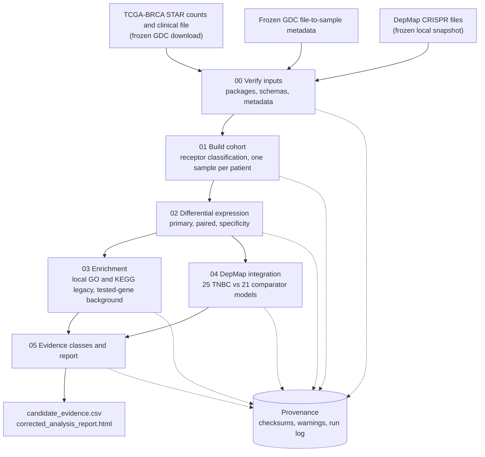

# TNBC Target Discovery: A Reproducible Multi-Resource Workflow

This repository documents a reproducible triple-negative breast cancer (TNBC)
therapeutic-target nomination workflow built from publicly available cancer
research resources: TCGA-BRCA expression and clinical data from the NCI Genomic
Data Commons, DepMap CRISPR dependency screens, and Gene Ontology and MSigDB
gene-set collections.

Its provenance, decision-record, audit, and evidence-preservation practices
informed the proposed Cancer Data Reuse Accelerator and Research-Ready Evidence
Package framework. This repository is the implemented precursor from which
those practices were generalized. It is not an implementation of the
Accelerator itself.

## Scientific Question

Which genes are overexpressed in TNBC tumors relative to normal breast tissue,
remain supported in paired and TNBC-specificity analyses, and show dependency
in TNBC cell-line CRISPR screens? The workflow nominates candidates for further
study. It does not establish causal dependency, safety, druggability, or
therapeutic efficacy.

## What This Repository Demonstrates

| Practice | Where to inspect it |
| --- | --- |
| Written design specification and implementation plan, dated 2026-08-19 | [`docs/superpowers/specs/`](docs/superpowers/specs/), [`docs/superpowers/plans/`](docs/superpowers/plans/) |
| Audit of an earlier workflow, with each defect tied to a correction and an enforcing test | [`docs/AUDIT_REMEDIATION.md`](docs/AUDIT_REMEDIATION.md) |
| Preservation of the audited workflow instead of overwriting it | `tnbc_analysis_claude.r`, `results/`, `plots/`, [`provenance/`](provenance/) |
| Frozen inputs, one recorded metadata lookup, and offline reruns | [`analysis_v2/provenance/`](analysis_v2/provenance/) |
| Checksum records linking the published code to the validated run | [`analysis_v2/provenance/source_checksums.sha256`](analysis_v2/provenance/source_checksums.sha256) |
| Thresholds and decision rules declared in configuration, not code | [`analysis_v2/config/analysis.yml`](analysis_v2/config/analysis.yml) |
| Separate evidence streams with no composite score | [`analysis_v2/R/evidence.R`](analysis_v2/R/evidence.R) |
| Retained limitations, empty results, and unavailable evidence | [`analysis_v2/provenance/warnings.csv`](analysis_v2/provenance/warnings.csv), open findings in the audit record |
| Fixture-based automated tests | [`analysis_v2/tests/testthat/`](analysis_v2/tests/testthat/) |
| Source and redistribution record | [`docs/DATA_SOURCES.md`](docs/DATA_SOURCES.md) |

## Workflow



Each stage validates its upstream contracts and stops on the first failure.
Stages can be rerun individually from the point of failure.

## Validated Snapshot

The full workflow completed on 2026-08-20 with R 4.4.2.

| Item | Result |
| --- | --- |
| Cohort | 115 TNBC tumors, 113 solid-tissue normals, 862 receptor-defined other tumors |
| Exclusions | 120 tumors with ambiguous or missing receptor evidence; 14 duplicate patient samples |
| Paired sensitivity analysis | 11 matched TNBC-normal patients |
| DepMap panels | 25 TNBC and 21 ER-positive or HER2-positive breast models |
| Evidence classes | 4 `A_multistream`, 353 `B_expression_dependency`, 4,768 `C_expression_only`, 21,433 `not_candidate` |
| Tests | 53 test blocks; 143 expectations with no failures, errors, warnings, or skips |

The four Class A nominations are KIF2C, PFN1, PGK1, and C19orf53. They are
screening classes, not validated targets. Full contrast tables and limitations
are in [`PROJECT_RESTART_STATUS.md`](PROJECT_RESTART_STATUS.md).

An independent rerun of the test suite on 2026-09-25 (Ubuntu 24.04, R 4.3.3)
passed 134 expectations with no failures. Two test blocks could not run there
because the Bioconductor packages `apeglm` and `clusterProfiler` were not
installed.

## Verify This Snapshot

No R installation or large data download is needed:

```bash
bash tools/verify_release.sh
```

The script confirms that all 30 workflow code, configuration, test, report,
and design files are byte-identical to the versions recorded by the validated
run, checks the
preserved 2025 baseline, confirms that no machine-specific paths remain, and
prints the test and audit inventory. It exits with a nonzero status on any
failure.

## Reproduce the Analysis

1. Obtain the inputs as described in [`docs/DATA_SOURCES.md`](docs/DATA_SOURCES.md).
   They are not redistributed here.
2. Install R 4.4.2 and these packages: data.table, dplyr, yaml, digest,
   jsonlite, DESeq2, apeglm, clusterProfiler, AnnotationDbi, org.Hs.eg.db,
   GO.db, msigdbr, fgsea, ggplot2, ggrepel, rmarkdown, testthat, and
   TCGAbiolinks. The validated run used `org.Hs.eg.db` and `GO.db` 3.20.0 and
   MSigDB 2024.1.Hs.
3. From the repository root:

```bash
sha256sum -c analysis_v2/provenance/input_checksums.sha256
TZ=UTC Rscript analysis_v2/tests/testthat.R
TZ=UTC Rscript analysis_v2/run_all.R
```

On a cluster that uses environment modules, run `module load R/4.4.2` first.
Stage recovery and output locations are described in
[`analysis_v2/README.md`](analysis_v2/README.md).

## Negative and Limiting Findings Are Retained

- Genes that meet no evidence rule stay in the output as `not_candidate`
  rather than being dropped.
- An enrichment test with no qualifying genes returns an explicit status, not
  an empty plot.
- Evidence that could not be obtained is labeled as unavailable. Tractability
  is reported as not assessed, and the DepMap release is recorded as
  unresolved.
- Covariates that failed the confounding check (race and tissue-source site)
  are recorded with the reason for rejection.
- Seven scientific warnings travel with the results in
  [`warnings.csv`](analysis_v2/provenance/warnings.csv), and five open
  engineering findings are listed in the audit record.

## Repository Layout

| Path | Contents |
| --- | --- |
| `analysis_v2/` | Corrected, reproducible workflow: `R/` modules, numbered `scripts/`, `config/`, `tests/`, `provenance/`, and the report template |
| `docs/` | Design specification, implementation plan, audit record, and data-source record |
| `tools/verify_release.sh` | Offline verification of this snapshot |
| `tnbc_analysis_claude.r`, `results/`, `plots/` | Preserved 2025 exploratory workflow and outputs (historical; not comparable with corrected results) |
| `DepMapCrispr/` | Preserved single-model DepMap integration and its outputs |
| `provenance/` | Checksums protecting the preserved legacy state |
| `MANIFEST.txt` | GDC download manifest for the clinical supplement |

## License

The code and documentation in this repository are released under the
[MIT License](LICENSE). The license does not extend to the third-party data
resources the workflow reads; those remain under their providers' terms (see
[`docs/DATA_SOURCES.md`](docs/DATA_SOURCES.md)).

## Citation

Citation metadata is in [`CITATION.cff`](CITATION.cff). Results derived from
this workflow should also cite the data providers listed in
[`docs/DATA_SOURCES.md`](docs/DATA_SOURCES.md).
